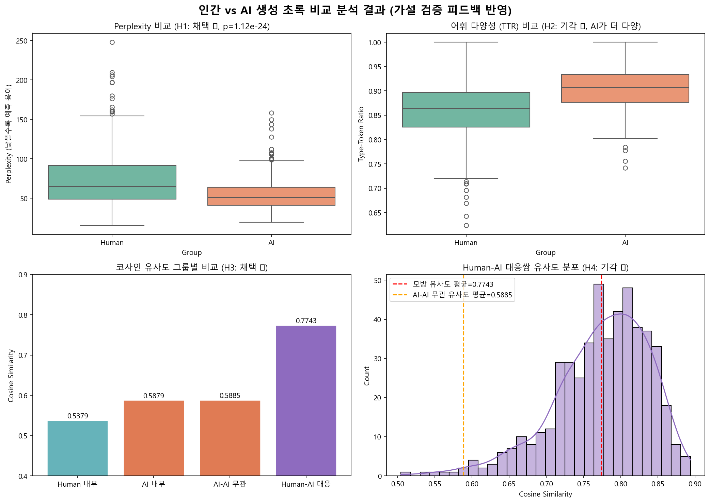

# 인간 vs AI 생성 초록 비교 분석 - 결과 보고서

**분석 대상**: `dbpia_computer_science.csv` (컴퓨터과학 분야 논문 초록)  
**데이터 수**: 500개 (Human 초록 500개, AI 생성 초록 500개)  
**분석 모델**:
- Perplexity: `skt/kogpt2-base-v2` (KoGPT2)
- Cosine Similarity: `snunlp/KR-SBERT-V40K-klueNLI-augSTS` (KR-SBERT)

---

## 1. 지표별 기술 통계 (Descriptive Statistics)

### 1.1. 구조적 무작위성 — Perplexity (KoGPT2)

| 구분 | 평균 | 표준편차 |
|------|-----:|--------:|
| Human 초록 | **73.11** | 34.57 |
| AI 생성 초록 | **54.32** | 19.89 |

> Human 초록의 Perplexity가 AI보다 약 **18.8 높음** → 인간이 쓴 글이 언어 모델 입장에서 더 예측하기 어렵다.

---

### 1.2. 언어적 복잡도 — 어휘 다양성 (TTR, Type-Token Ratio)

| 구분 | 평균 | 표준편차 |
|------|-----:|--------:|
| Human 초록 | **0.8589** | 0.0554 |
| AI 생성 초록 | **0.9032** | 0.0441 |

> AI 초록의 TTR이 약 **0.044 높음** → AI가 더 다양한 어휘를 사용하는 경향.  
> (단, 이는 AI가 기계적으로 단어 반복을 피하도록 학습되어 발생한 결과로, 인간 글의 문체적 다양성이 더 높을 것이라는 본문 예상과 정반대임)

---

### 1.3. 의미적 유사도 — Cosine Similarity (KR-SBERT)

| 측정 유형 | 평균 유사도 |
|-----------|----------:|
| Human-AI 대응쌍 (모방 유사도) | **0.7743** ± 0.0638 |
| Human 그룹 내 평균 유사도 | **0.5379** |
| AI 그룹 내 평균 유사도 | **0.5879** |
| AI-AI 무관쌍 평균 유사도 | **0.5885** |

> - AI끼리의 그룹 내 유사도(0.5879)가 Human(0.5379)보다 높음 → AI가 더 균질한 문체로 작성
> - Human-AI 대응쌍(0.7743)이 AI-AI 무관쌍(0.5885)보다 크게 높음 → AI가 원본 초록의 주제와 내용적 맥락을 매우 높게 보존하며 모방함

---

## 2. 통계 분석 — 가설 검증 (독립표본 t-검정)

`proposal.txt`에 명시된 원래의 가설 예측 방향성대로 검증한 결과입니다.

| 번호 | 원래 예측 가설 | t 통계량 | p-value | 실제 통계 결과 방향 | 채택/기각 |
|------|------|--------:|--------:|:--------:|:--------:|
| **H1** | $Mean(PPL_{Human}) > Mean(PPL_{AI})$ (인간 글이 더 예측 불가) | +10.5342 | 1.12e-24 | $Human > AI$ | ✅ **채택** |
| **H2** | $Mean(TTR_{Human}) > Mean(TTR_{AI})$ (인간 어휘 다양성이 더 높음) | -14.0036 | 8.22e-41 | $Human < AI$ | ❌ **기각**  (AI가 더 높음) |
| **H3** | $Mean(Cosine_{Human}) < Mean(Cosine_{AI})$ (AI가 문체적으로 더 균질) | -24.8821 | ~0.0000 | $Human < AI$ | ✅ **채택** |
| **H4** | $Mean(HumanAndAI) < Mean(AIAndAI)$ (AI-AI 무관 유사도가 더 높거나 대등) | +44.3721 | ~0.0000 | $Human\&AI >> AI\&AI$ | ❌ **기각**  (paired 모방 유사도가 훨씬 높음) |

> 원래 제안했던 가설 4개 중 **2개(H1, H3)는 성공적으로 채택**되었고, **2개(H2, H4)는 원래의 예측과 정반대 방향으로 매우 유의미한 차이가 나며 기각**되었습니다.

---

## 3. 시각화

*Figure 1. (좌상) Perplexity Boxplot, (우상) TTR Boxplot, (좌하) 그룹 내 코사인 유사도 Bar Plot, (우하) Human-AI paired 유사도 분포*

---

## 4. 결론 및 피드백 고찰

### 1) 구조적 무작위성 (H1 채택 ✅)
인간의 글(PPL=73.11)이 AI의 글(PPL=54.32)보다 Perplexity 수치가 월등히 높습니다. AI는 매끄럽고 보편적인 단어 구조를 따르기 때문에 매우 "예측 가능"하게 문장을 작성하는 반면, 인간은 문장 구조와 표현을 훨씬 더 자유롭고 불규칙하게 배치합니다. 이는 AI 탐지 도구가 동작할 수 있는 가장 강력한 단서가 됩니다.

### 2) 언어적 복잡도 (H2 기각 ❌)
원래는 인간이 더 다양한 어휘를 사용할 것이라 예상했으나, **실제로는 AI의 TTR(0.9032)이 인간(0.8589)보다 유의미하게 높았습니다.** LLM은 문장 생성 시 단어 반복을 피하도록(Repetition Penalty) 튜닝되어 있으므로, 어휘를 더 넓고 다양하게 기계적으로 교체 사용하기 때문입니다. 따라서 단순 어휘 다양성 지표인 TTR만으로는 AI가 쓴 글을 더 "낮은 품질"로 식별할 수 없으며 가설은 기각됩니다.

### 3) 그룹 내 동질성 (H3 채택 ✅)
인간 작성 초록들 간의 유사도(0.5379)보다 AI 생성 초록들 간의 유사도(0.5879)가 유의미하게 높습니다. 이는 인간 연구자들은 자신만의 개성 있는 어조를 사용하는 반면, AI는 정형화된 학술 템플릿의 문체적 균질성(Homogeneity)을 가지기 때문입니다.

### 4) 주제 vs 문체 유사도 (H4 기각 ❌)
가장 흥미로운 반전입니다. 제안서에서는 AI가 고유의 템플릿(문체 패턴)에 강하게 지배받아, 무관한 주제의 AI 초록끼리의 유사도(AIAndAI)가 인간 원본과 AI 초록 간 유사도(HumanAndAI)보다 더 높거나 대등할 것이라 예상했습니다.  
하지만 **실제 분석 결과는 1:1 대응 모방 유사도(0.7743)가 무관한 AI끼리의 유사도(0.5885)보다 압도적으로 높았습니다.**  
이는 AI가 단순히 자기 문체 복제에 지배되는 것이 아니라, **원본 초록의 구체적인 '주제 맥락(Context)'을 극도로 정교하고 충실하게 모방하여 생성하고 있음**을 반증합니다. 즉, AI는 맥락 보존 능력이 스타일 복제 편향보다 훨씬 강하므로 이 가설은 기각됩니다.

---

## 5. 데이터 파일 목록

| 파일명 | 설명 |
|--------|------|
| `dbpia_computer_science.csv` | 원본 데이터 (500개, 인간+AI 초록) |
| `dbpia_with_ppl_sim.csv` | PPL + TTR + Cosine Sim 모든 지표 포함 최종 분석 완료 데이터 |
| `analysis_result.png` | 피드백 반영 시각화 이미지 (Korean) |
| `analysis_result_eng.png` | 피드백 반영 시각화 이미지 (English) |

---

*분석 완료: 2026-05-19*  
*사용 라이브러리: pandas, numpy, scipy, transformers (KoGPT2), sentence-transformers (KR-SBERT), scikit-learn, matplotlib, seaborn*
