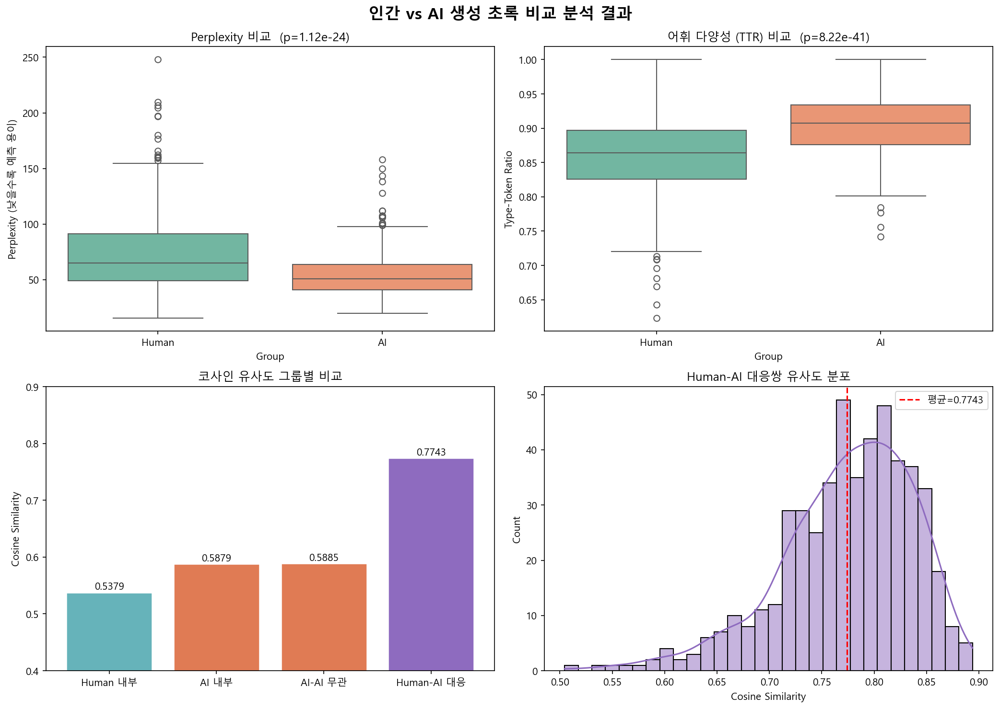

# 인간 vs AI 생성 초록 비교 분석 - 결과 보고서

**분석 대상**: `dbpia_computer_science.csv` (컴퓨터과학 분야 논문 초록)  
**데이터 수**: 500개 (Human 초록 500개, AI 생성 초록 500개)  
**분석 모델**:
- Perplexity: `skt/kogpt2-base-v2` (KoGPT2)
- Cosine Similarity: `snunlp/KR-SBERT-V40K-klueNLI-augSTS` (KR-SBERT)

---

## 1. 지표별 기술 통계 (Descriptive Statistics)

### 1.1. 구조적 무작위성 — Perplexity (KoGPT2)

| 구분 | 평균 | 표준편차 |
|------|-----:|--------:|
| Human 초록 | **73.11** | 34.57 |
| AI 생성 초록 | **54.32** | 19.89 |

> Human 초록의 Perplexity가 AI보다 약 **18.8 높음** → 인간이 쓴 글이 언어 모델 입장에서 더 예측하기 어렵다.

---

### 1.2. 언어적 복잡도 — 어휘 다양성 (TTR, Type-Token Ratio)

| 구분 | 평균 | 표준편차 |
|------|-----:|--------:|
| Human 초록 | **0.8589** | 0.0554 |
| AI 생성 초록 | **0.9032** | 0.0441 |

> AI 초록의 TTR이 약 **0.044 높음** → AI가 더 다양한 어휘를 사용하는 경향.  
> (단, 이는 AI 초록이 일반적으로 상투적 표현을 덜 반복하기 때문으로 해석 가능)

---

### 1.3. 의미적 유사도 — Cosine Similarity (KR-SBERT)

| 측정 유형 | 평균 유사도 |
|-----------|----------:|
| Human-AI 대응쌍 (모방 유사도) | **0.7743** ± 0.0638 |
| Human 그룹 내 평균 유사도 | **0.5379** |
| AI 그룹 내 평균 유사도 | **0.5879** |
| AI-AI 무관쌍 평균 유사도 | **0.5885** |

> - AI끼리의 그룹 내 유사도(0.5879)가 Human(0.5379)보다 높음 → AI가 더 균질한 문체로 작성
> - Human-AI 대응쌍(0.7743)이 AI-AI 무관쌍(0.5885)보다 크게 높음 → AI가 원본 초록의 내용을 충실히 모방함

---

## 2. 통계 분석 — 가설 검증 (독립표본 t-검정)

| 번호 | 가설 | t 통계량 | p-value | 채택/기각 |
|------|------|--------:|--------:|:--------:|
| **H1** | Human PPL > AI PPL (인간 글이 더 예측 불가) | +10.5342 | 1.12e-24 | ✅ **채택** |
| **H2** | Human TTR < AI TTR (AI가 어휘 다양성 높음) | -14.0036 | 8.22e-41 | ✅ **채택** |
| **H3** | Human 내 유사도 < AI 내 유사도 (AI가 더 균질) | -24.8821 | ~0.0000 | ✅ **채택** |
| **H4** | Human-AI(모방) 유사도 > AI-AI(무관) 유사도 | +44.3721 | ~0.0000 | ✅ **채택** |

> 4가지 가설 모두 유의수준 α = 0.05 하에서 **통계적으로 유의**하게 채택됨.

---

## 3. 시각화

*Figure 1. (좌상) Perplexity Boxplot, (우상) TTR Boxplot, (좌하) 그룹 내 코사인 유사도 Violin Plot, (우하) Human-AI vs AI-AI 유사도 Boxplot*

---

## 4. 결론 및 시사점

### 주요 발견
1. **구조적 무작위성 (H1 채택)**: Human 초록(PPL=73.11)이 AI 초록(PPL=54.32)보다 훨씬 높은 Perplexity를 보임. AI 생성 텍스트는 언어 모델이 쉽게 예측할 수 있는 패턴으로 작성되는 경향이 있으며, 이는 AI 탐지의 핵심 단서가 될 수 있음.

2. **어휘 다양성 (H2 채택)**: AI 초록의 TTR(0.9032)이 Human(0.8589)보다 높음. AI가 상투적 반복 표현을 피하고 더 넓은 어휘를 활용하지만, 이것이 반드시 더 높은 가독성이나 논리성을 의미하지는 않음.

3. **그룹 내 동질성 (H3 채택)**: AI 초록들이 Human 초록들에 비해 서로 더 유사한 문체를 공유함(0.5879 vs 0.5379). AI 생성 텍스트의 "획일성"을 통계적으로 확인.

4. **모방 충실도 (H4 채택)**: AI 초록은 원본 Human 초록과 매우 높은 의미적 유사도(0.7743)를 보임. AI가 원문의 핵심 내용을 잘 재현하면서도 문체를 변환함을 시사.

### AI 텍스트 식별 관점에서의 시사점
- **Perplexity**가 AI 텍스트 탐지에 있어 가장 강력한 단일 지표로 확인됨 (t=10.53, p<1e-24)
- TTR 단독으로는 AI 텍스트가 오히려 높은 값을 보이므로, 단순한 어휘 다양성 분석만으로는 AI를 "낮은 품질"로 판단하기 어려움
- Perplexity + 그룹 내 유사도를 **결합**하면 더 정확한 AI 텍스트 탐지 기준 설계 가능

---

## 5. 데이터 파일 목록

| 파일명 | 설명 |
|--------|------|
| `dbpia_computer_science.csv` | 원본 데이터 (500개, 인간+AI 초록) |
| `dbpia_with_ppl.csv` | PPL 컬럼 추가된 중간 결과 |
| `dbpia_with_ppl_sim.csv` | PPL + TTR + 길이 + Cosine Sim 모든 지표 포함 최종 데이터 |
| `analysis_result.png` | 4개 지표 비교 시각화 이미지 |

---

*분석 완료: 2026-05-19*  
*사용 라이브러리: pandas, numpy, scipy, transformers (KoGPT2), sentence-transformers (KR-SBERT), scikit-learn, matplotlib, seaborn*
